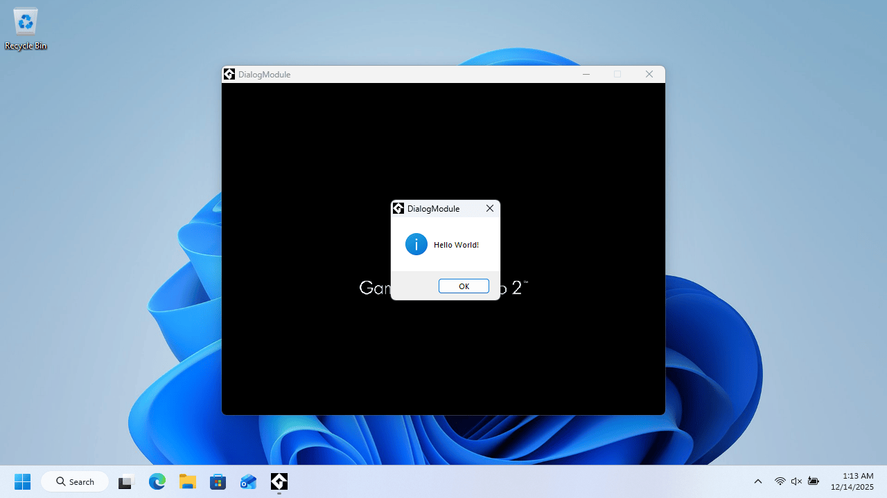
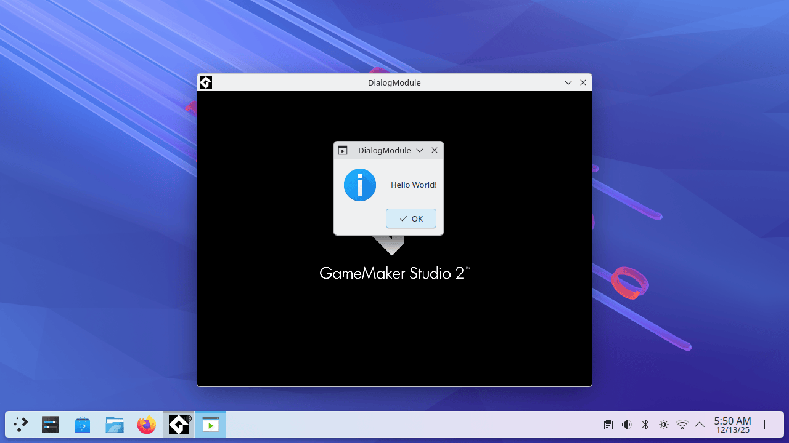

# Dialog Module
Cross-platform native dialog boxes which match your desktop environment and support a multiple file filter drop down box.
Uses kdialog for Qt dialogs on KDE, zenity for GTK on non-KDE Free Desktop platforms, WinAPI on Windows, AppKit on macOS.
Supports Windows, macOS, Linux, FreeBSD, DragonFly BSD, NetBSD, OpenBSD, Solaris, and illumos. No third-party dependency.
If kdialog and/or zenity do not exist on the target Free Desktop platform you can use whatever fallback of your choosing.
Requires setting an owner window handle in order to function properly: HWND on Windows, NSWindow * on macOS, or X11/xlib.
The window handle needs to be casted to an unsigned integer pointer, wrapped into a string, passed to widget_set_owner().

Click the slideshows below to view documentation and screenshots:

