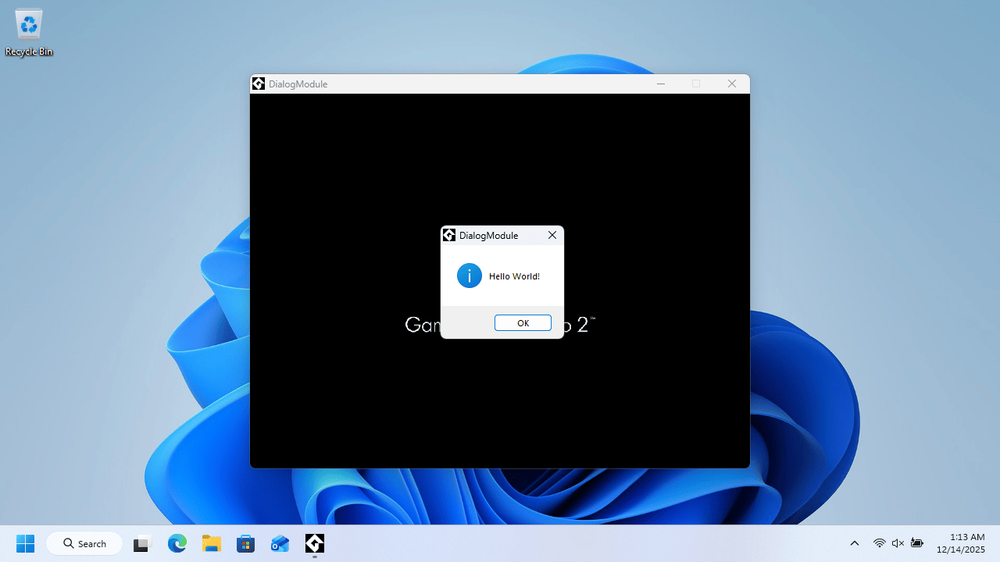
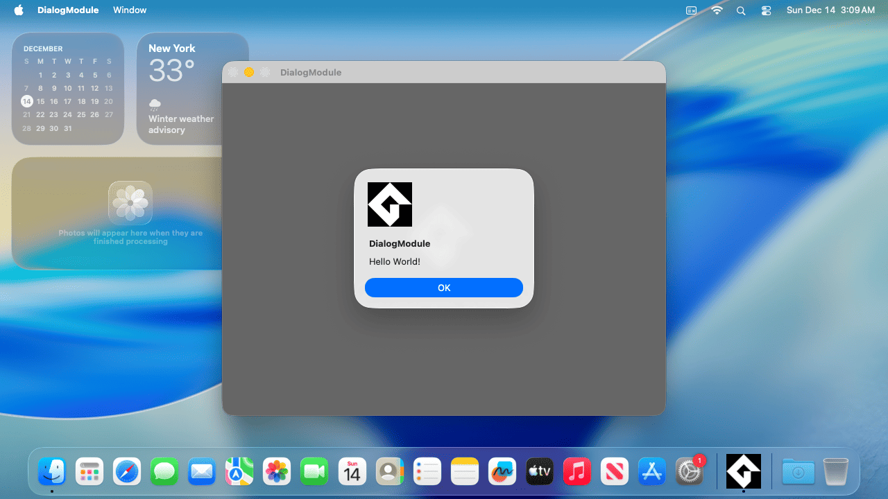
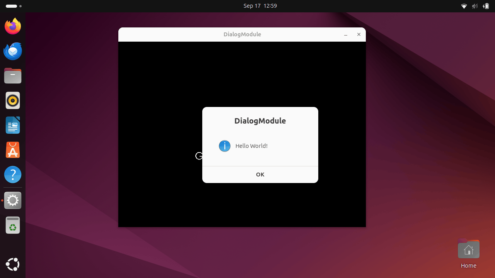

# Dialog Module - The Universal Dialog Library!
Cross-platform native dialog boxes which match your desktop environment and support a multiple file filter drop down box. On Linux, this library uses the XDG Desktop Portal with D-Bus to produce file and directory selection dialogs, (while wrapping the "[Native File Dialog Extended](https://github.com/btzy/nativefiledialog-extended)" library by [Bernard Teo](https://github.com/btzy), a fork of the "[Native File Dialog](https://github.com/mlabbe/nativefiledialog)" library by [Michael Labbe](https://github.com/mlabbe)). Where applicable, this library will use `kdialog` for Qt dialogs on KDE-based Free Desktop platforms, (which is based on whether the `XDG_CURRENT_DESKTOP` environment variable contains the substring "`KDE`"), `zenity` for GTK on non-KDE-based Free Desktop platforms, WinAPI on Windows, and AppKit, (or OSAScript when outside the main-thread), on macOS. All platforms support multi-threading, given one dialog is opened at a time, and not multiple, due to their underlying implementations relying on `static` and global variables. 

Supports Windows, macOS, Linux, FreeBSD, DragonFly BSD, NetBSD, OpenBSD, Solaris, and illumos. No third-party dependencies. If `kdialog` or `zenity` do not exist on the target Free Desktop platform you can use whatever fallback of your choosing. Setting the owner window needs to take on the following form: an `HWND` on Windows, an `NSWindow *` on macOS, or an `XID`/`Window` on X11/XWayland. The owner window handle needs to be casted to an unsigned integer pointer, wrapped into a C-string, and then passed to `widget_set_owner(owner)` to function; if you do not do this on macOS, OSAScript will be used instead of native AppKit. Click the animated GIF slideshows below to view documentation:

