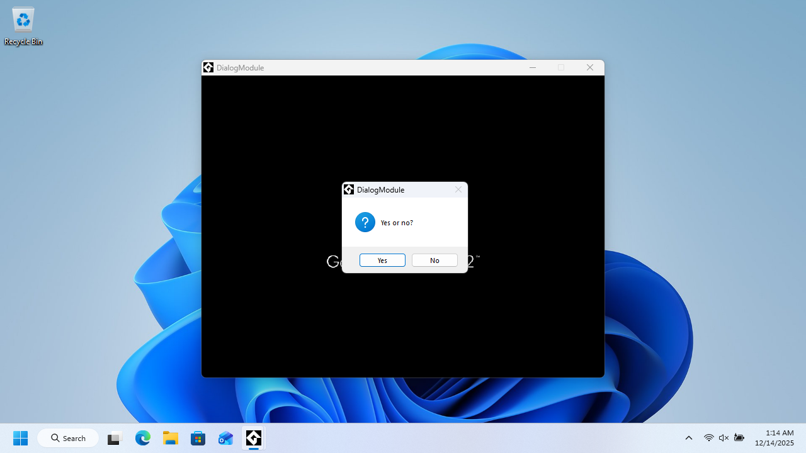
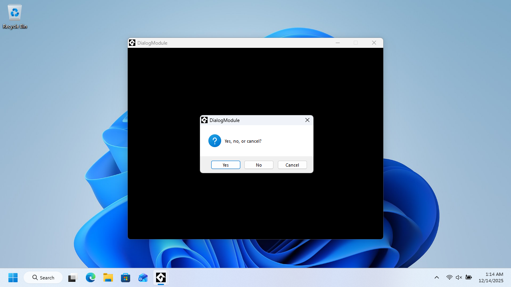
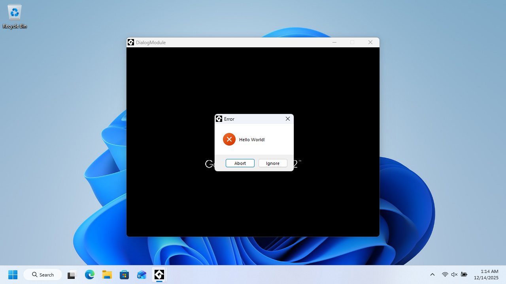
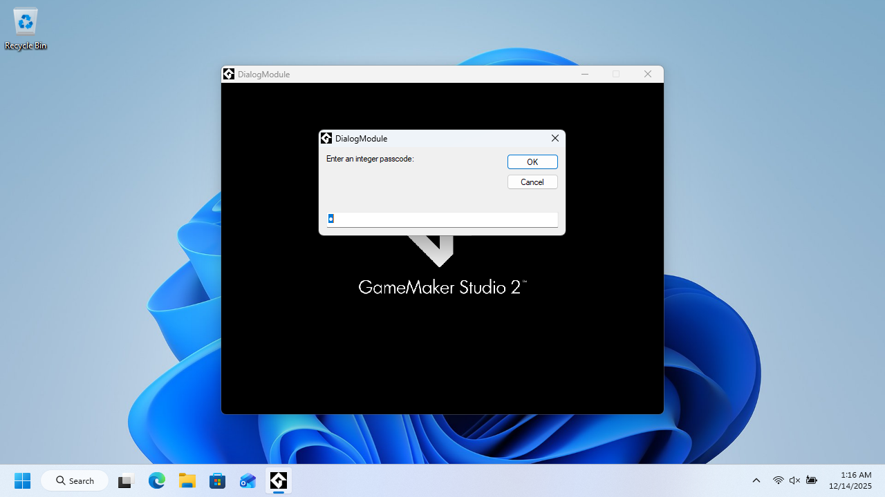
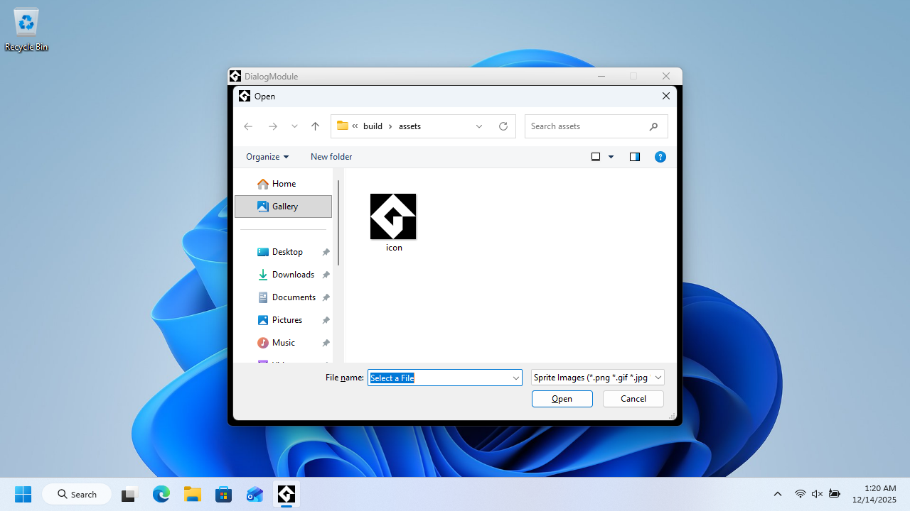
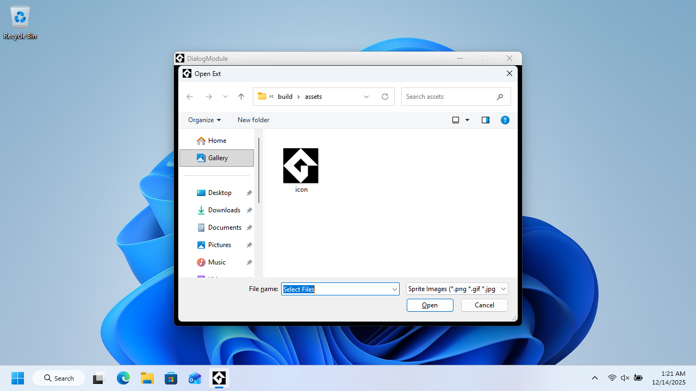
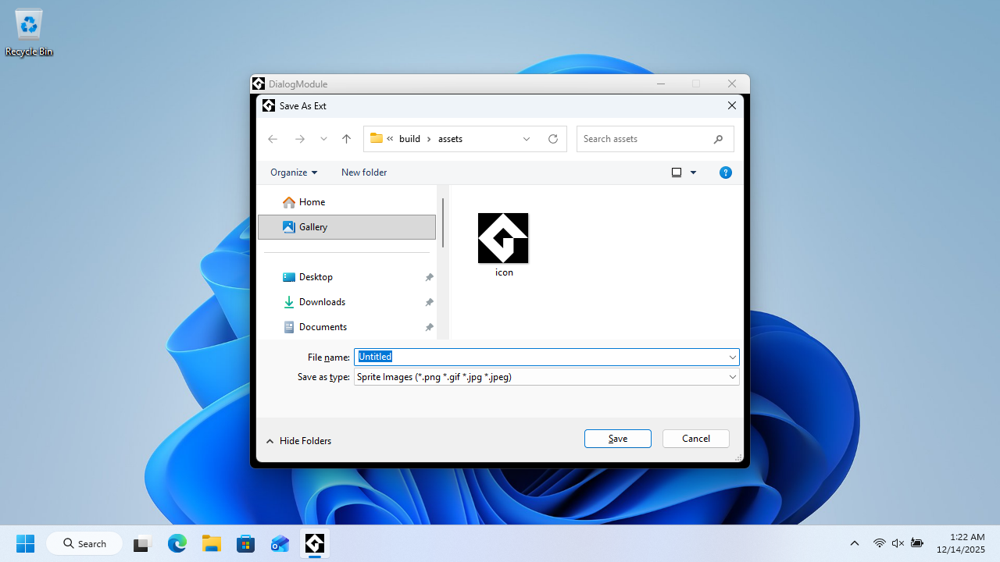
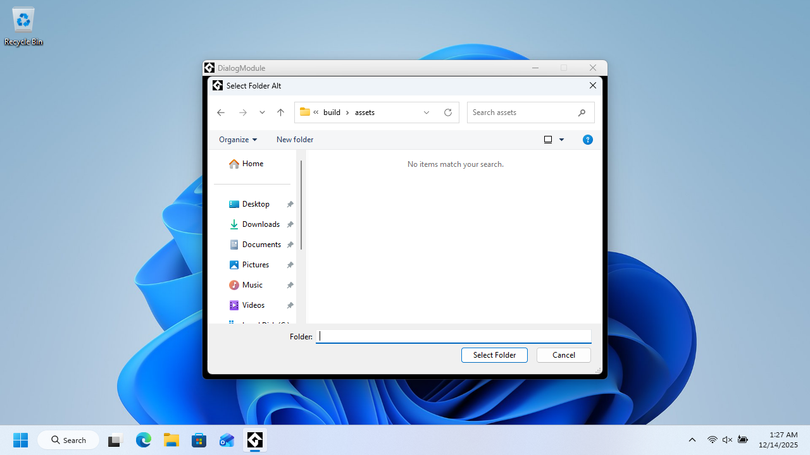
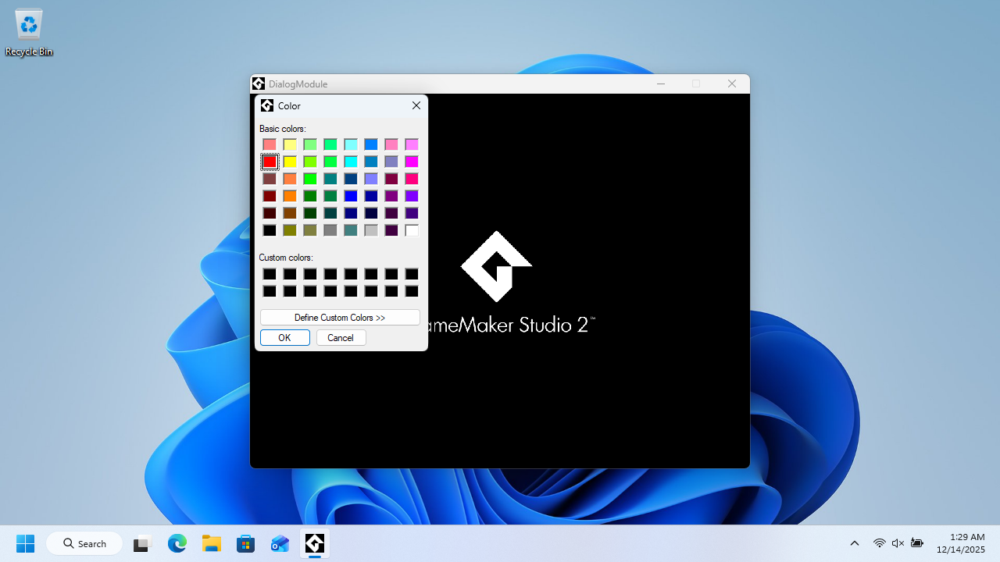

# OK-Only ​Information Box

`real show_message(string str)` Displays a modal information message box with an "OK" button to make it close. When the dialog Is closed, it will return 1 and go back to the main application. The developer may set the message text using the argument.

# OK/Cancel ​Information Box

`real show_message_cancelable(string str)` ​Displays a modal information message box with an "OK" and a "Cancel" button. Clicking "OK" will return 1, and clicking "Cancel" will return -1. When the function returns, the dialog closes, and the user is then taken back to the main application. The developer may set the message text using the argument.

# Yes/No ​Question Box

`real show_question(string str)` ​Displays a modal question message box with a "Yes" and a "No" button, for the user to choose which to click as their answer. When "Yes" is clicked, 1 is returned or if "No" is clicked, zero is returned. The user will then be sent back to the main application. Use the argument to set the message text.

# Yes/No/Cancel ​Question Box

`real show_question_cancelable(string str)` ​Displays a modal question message box with a "Yes", a "No", and a "Cancel" button, for the user to choose which to click as their answer. When "Yes" is clicked, 1 is returned. If "No" is clicked, zero is returned. If "Cancel" is clicked, -1 is returned. The developer may set the message text using the argument.

# Retry/Cancel Error

`real show_attempt(string str)` Displays a modal error message box which will prompt the user as to whether they want to retry a specific action that previously just failed, or cancel the operation. The "Retry" button returns zero, and the "Cancel" button returns -1. The developer may use the argument to specify the error message text.

# Abort/Ignore Error

`real show_error(string str,real abort)` Displays a modal error message box which will prompt the user as to whether they want to abort the application or ignore the error. The first argument is the error message text. The second argument is for whether the error message is fatal, meaning it will only have the option to abort, and without an option to ignore the error. When the error is not fatal, only the "Abort" button will force the application to close. When non-fatal, the "Ignore" button returns -1. When the application aborts, there is no return value to be retrieved.

# String ​Input Box

`string get_string(string str,string def)` Displays a modal string input box with the message text defined in the first argument, and the default string to show in the text box used as the second argument. There is an "OK" button, that when clicked the dialog closes and returns the string that is left in the text box. If "Cancel" was clicked, the dialog closes and returns an empty string.

# String ​Password Box

`string get_password(string str,string def)` ​Displays a modal string input box with the message text defined in the first argument, and the default string to show in the text box used as the second argument. There is an "OK" button, that when clicked the dialog closes and returns the string that is left in the text box. If "Cancel" was clicked, the dialog closes and returns an empty string. Text entry is hidden.

# Number ​Input Box

`real get_integer(string str,real def)` Displays a modal number input box with the message text defined in the first argument, and the default number in the text box used as the second argument. There is an "OK" button, that when clicked the dialog closes and returns the number that is left in the text box. If "Cancel" was clicked, the dialog closes and returns zero. If a value that is not recognized as a valid number is entered, zero is always returned. The default number and the number returned cannot exceed 15 digits, therefore it will always be limited to a value from -999999999999999 to 999999999999999.

# Number ​Passcode Box

`real get_passcode(string str,real def)` Displays a modal number input box with the message text defined in the first argument, and the default number in the text box used as the second argument. There is an "OK" button, that when clicked the dialog closes and returns the number that is left in the text box. If "Cancel" was clicked, the dialog closes and returns zero. If a value that is not recognized as a valid number is entered, zero is always returned. The default number and the number returned cannot exceed 15 digits, therefore it will always be limited to a value from -999999999999999 to 999999999999999. Text entry is hidden.

# Open File Dialog

`string get_open_filename(string filter,string fname)` Displays a modal single file selection dialog using the given filter which is used like "Description1|Extension1|Description2|Extension2A;Extension2B" where the earlier is the description of the file filter and the latter is the extension pattern. The descriptions and extension patterns are separated by a vertical slash character "|", and if one of the descriptions describe multiple file patterns, separate the file patterns with a semicolon. An example of a filter argument can be "Image Files|`*`.png;`*`.jpeg;`*`.jpg;`*`.gif" which will allow selection of a single png, jpeg, jpg, or gif file. The second argument is the default file name for the dialog to have in the text box. When "Cancel" is chosen an empty string is returned, otherwise the file selected is returned.

# Open File Dialog (Extended)

`string get_open_filename_ext(string filter,string fname,string dir,string title)` Displays a modal single file selection dialog using the given filter which is used like "Description1|Extension1|Description2|Extension2A;Extension2B" where the earlier is the description of the file filter and the latter is the extension pattern. The descriptions and extension patterns are separated by a vertical slash character "|", and if one of the descriptions describe multiple file patterns, separate the file patterns with a semicolon. An example of a filter argument can be "Image Files|`*`.png;`*`.jpeg;`*`.jpg;`*`.gif" which will allow selection of a single png, jpeg, jpg, or gif file. The second argument is the default file name for the dialog to have in the text box. When "Cancel" is chosen an empty string is returned, otherwise the file selected is returned. The third argument specifies the default directory for the dialog to open in. The last argument changes the window title text.

# Open Files Dialog

`string get_open_filenames(string filter,string fname)` Displays a modal multiple file selection dialog using the given filter which is used like "Description1|Extension1|Description2|Extension2A;Extension2B" where the earlier is the description of the file filter and the latter is the extension pattern. The descriptions and extension patterns are separated by a vertical slash character "|", and if one of the descriptions describe multiple file patterns, separate the file patterns with a semicolon. An example of a filter argument can be "Image Files|`*`.png;`*`.jpeg;`*`.jpg;`*`.gif" which will allow selection of one or more png, jpeg, jpg, or gif files. The second argument is the default file name for the dialog to have in the text box. When "Cancel" is chosen an empty string is returned, otherwise the file(s) selected are returned.

# Open Files Dialog (Extended)

`string get_open_filenames_ext(string filter,string fname,string dir,string title)` Displays a modal multiple file selection dialog using the given filter which is used like "Description1|Extension1|Description2|Extension2A;Extension2B" where the earlier is the description of the file filter and the latter is the extension pattern. The descriptions and extension patterns are separated by a vertical slash character "|", and if one of the descriptions describe multiple file patterns, separate the file patterns with a semicolon. An example of a filter argument can be "Image Files|`*`.png;`*`.jpeg;`*`.jpg;`*`.gif" which will allow selection of one or more png, jpeg, jpg, or gif files. The second argument is the default file name for the dialog to have in the text box. When "Cancel" is chosen an empty string is returned, otherwise the file(s) selected are returned. The third argument specifies the default directory for the dialog to open in. The last argument changes the window title text.

# Save File Dialog

`string get_save_filename(string filter,string fname)` Displays a modal single file "save as" dialog using the given filter which is used like "Description1|Extension1|Description2|Extension2A;Extension2B" where the earlier is the description of the file filter and the latter is the extension pattern. The descriptions and extension patterns are separated by a vertical slash character "|", and if one of the descriptions describe multiple file patterns, separate the file patterns with a semicolon. An example of a filter argument can be "Image Files|`*`.png;`*`.jpeg;`*`.jpg;`*`.gif" which will allow selection of a single png, jpeg, jpg, or gif file. The second argument is the default file name for the dialog to have in the text box. When canceled an empty string is returned, otherwise the file name chosen is returned.

# Save File Dialog (Extended)

`string get_save_filename_ext(string filter,string fname,string dir,string title)` Displays a modal single file "save as" dialog using the given filter which is used like "Description1|Extension1|Description2|Extension2A;Extension2B" where the earlier is the description of the file filter and the latter is the extension pattern. The descriptions and extension patterns are separated by a vertical slash character "|", and if one of the descriptions describe multiple file patterns, separate the file patterns with a semicolon. An example of a filter argument can be "Image Files|`*`.png;`*`.jpeg;`*`.jpg;`*`.gif" which will allow selection of a single png, jpeg, jpg, or gif file. The second argument is the default file name for the dialog to have in the text box. When "Cancel" is chosen an empty string is returned, otherwise the file name entered or selected is returned. The third argument specifies the default directory for the dialog to open in. The last argument changes the window title text.

# Folder Browser Dialog

`string get_directory(string dname)` Displays a modal single folder selection dialog. Use the argument to define the default place for the dialog to open in. When "Cancel" is chosen, an empty string is returned, otherwise the directory selected is returned, including the trailing slash at the end.

# Folder Browser Dialog (Alternative)

`string get_directory_alt(string capt,string root)` Displays an alternative modal single folder selection dialog. Use the first argument to define the title caption of the dialog. Use the second argument to define the default place for the dialog to open in. When "Cancel" is chosen, an empty string is returned, otherwise the directory selected is returned, including the trailing slash at the end.

# Color Picker Dialog

`real get_color(real defcol)` Displays a modal color selection dialog. When the "OK" button is clicked, the color that is selected is returned, and if "Cancel" is clicked, the value -1 is returned. Use the argument to specify the default color to be selected.

# Color Picker Dialog (Extended)

`real get_color_ext(real defcol,string title)` Displays a modal color selection dialog. When the "OK" button is clicked, the color that is selected is returned, and if "Cancel" is clicked, the value -1 is returned. Use the first argument to specify the default color to be selected when the dialog first opens. Use the second argument to change the caption.
